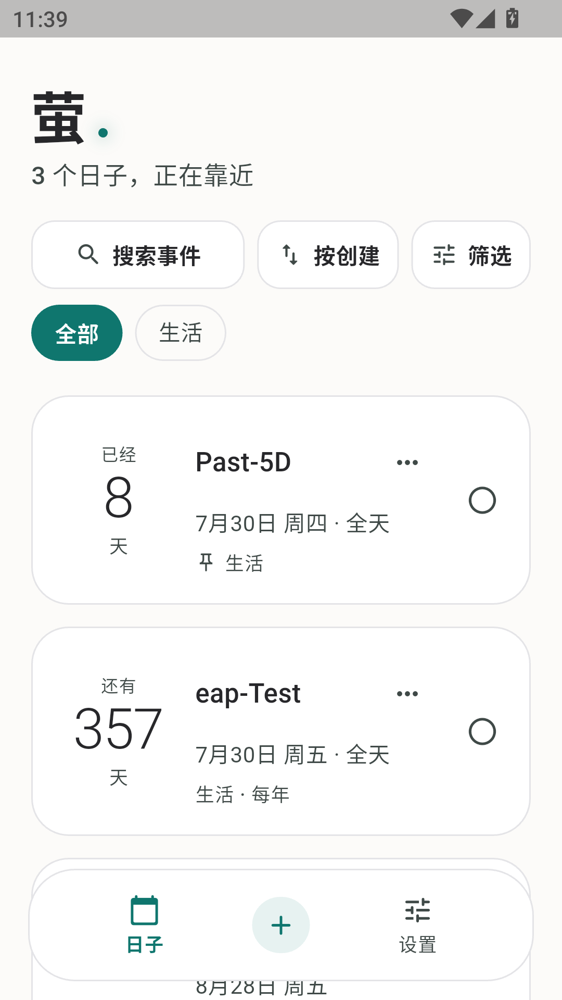
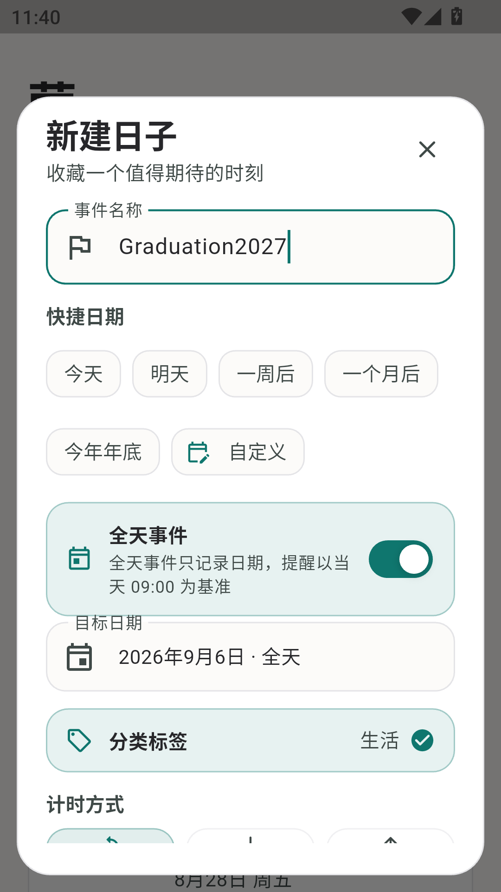
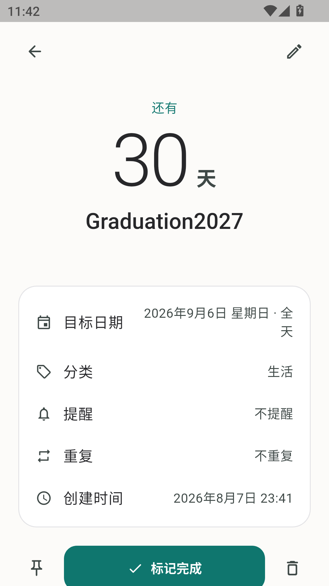
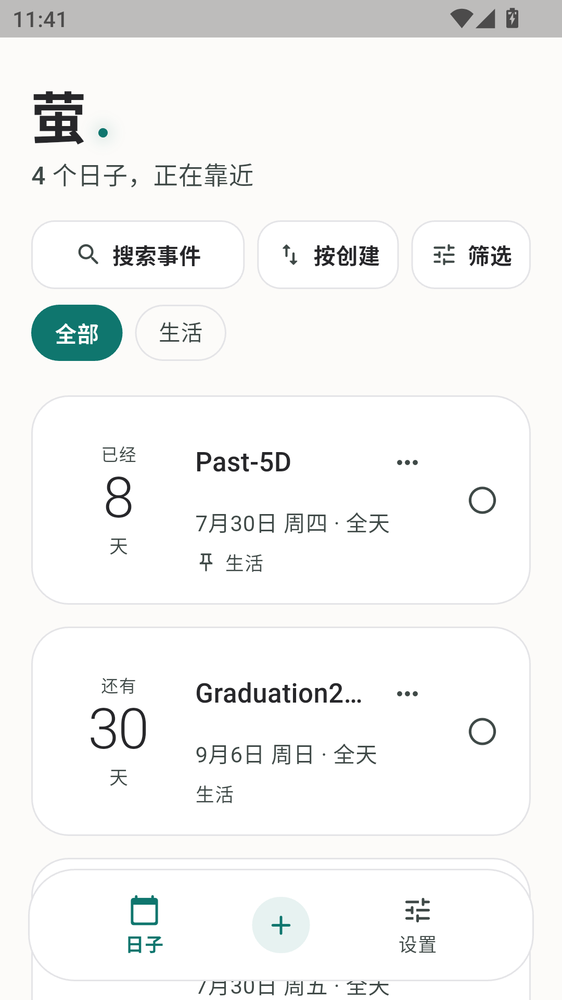
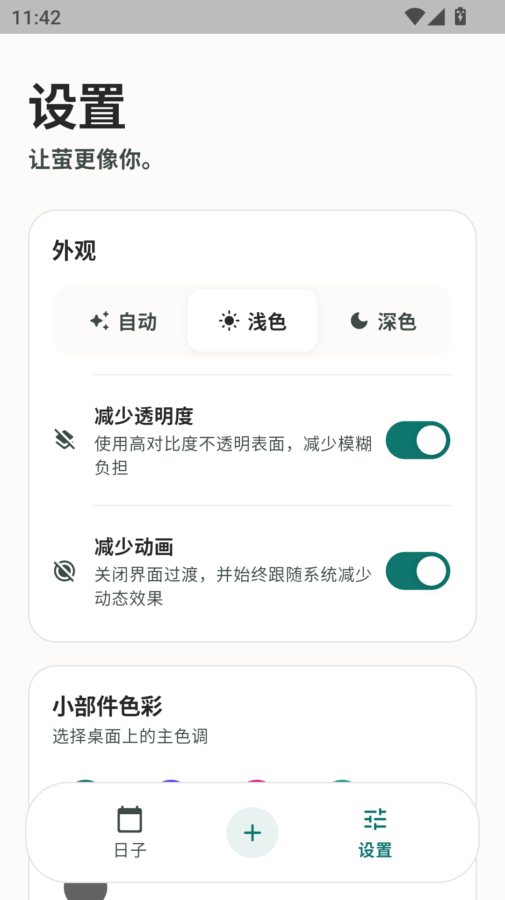

# 萤

<p align="center">
  
</p>

<p align="center">
  <b>用心记录每一个重要时刻</b><br>
  倒数日 · 正计时 · 桌面小部件 · 本地优先 · Android & iOS 双端
</p>

<p align="center">
  <a href="https://github.com/jiuxina/ying/stargazers">
    
  </a>
  <a href="https://github.com/jiuxina/ying/network/members">
    
  </a>
  <a href="https://github.com/jiuxina/ying/blob/main/LICENSE">
    
  </a>
  <a href="https://flutter.dev">
    
  </a>
  <a href="https://www.android.com">
    
  </a>
</p>

---

## 为什么选择萤

- **本地优先**：所有数据保存在设备本地，无账号、无服务端，隐私由你掌控
- **双端原生**：Android 与 iOS 双端覆盖，桌面小部件分别使用 AppWidget 与 WidgetKit 原生能力
- **Liquid Glass 视觉**：iOS 26 风格的动态渐变光晕、半透明模糊材质与玻璃事件卡片
- **轻量简洁**：专注倒数日核心功能，无冗余设计
- **高度可定制**：桌面小部件支持 14 套样式预设（含神秘信封、时间胶囊、复古 CRT、霓虹灯牌、像素血条、镜像整活）、逐元素文字颜色 / 字号 / 对齐 / 显隐、按钮显隐与整体垂直布局、壁纸取色、相册背景与节日皮肤；内容支持 Emoji、单位文案、精确到秒、农历星期、进度环、神秘模式、每日一句、临近高亮与数字字体；深色 / 浅色 / 跟随系统主题
- **无障碍友好**：完整语义、按钮替代滑动操作、通过 200% 文字缩放回归
- 如果可以的话，希望能点个 Star 支持一下呢～

---

## 目录

- [功能特性](#功能特性)
- [截图展示](#截图展示)
- [安装](#安装)
- [从源码构建](#从源码构建)
- [快速上手](#快速上手)
- [iOS 签名配置](#ios-签名配置)
- [平台说明](#平台说明)
- [Liquid Glass 设计](#liquid-glass-设计)
- [MuMu x86_64 调试构建](#mumu-x86_64-调试构建)
- [权限说明](#权限说明)
- [常见问题](#常见问题)
- [反馈与支持](#反馈与支持)
- [更新计划](#更新计划)
- [版本计划](#版本计划)
- [开源协议](#开源协议)

---

## 功能特性

### ⏱️ 倒计时与正计时

- 精确到秒的倒数日 / 正计时显示
- 自动 / 强制倒计时 / 正计时三种模式
- 智能天数计算，自动识别已过 / 未到事件
- 全天事件默认开启，支持今天、明天、一周后、一个月后、今年年底和自定义快捷日期

### 📋 事件管理

- 创建、编辑、删除事件：名称、目标日期、分类、备注
- 删除、完成和恢复支持连续撤销（6 秒撤销窗口）
- 每年重复；完成后自动推进到下一有效年份，2 月 29 日会跳过非闰年，并支持撤销
- 重要事件置顶、标题 / 备注搜索、分类筛选、只看未完成
- 距离 / 日期 / 创建时间多种排序，偏好跨启动保留
- 已完成事件独立折叠、显示数量并支持整体清理与撤销
- 事件卡片支持左右滑动、长按操作菜单（置顶 / 编辑 / 删除）、触觉反馈、按钮替代入口和独立详情页

### 📅 日历总览

- 底部「日历」Tab 提供月视图、年视图与按月份分组的日程列表
- 月视图标出事件日期并可点选查看当天事件；年视图快速定位月份；列表视图按月份浏览全部目标日期
- 每年重复事件按对应年份显示，2 月 29 日跳过非闰年；已完成事件淡化显示
- 右上角设置按钮进入分类菜单，外观与显示 / 桌面小部件 / 通知与提醒 / 数据管理 / 更新与关于分别进入独立设置页

### 🔔 提醒系统

- 每个事件最多 5 条提醒（事件发生时、30 分钟、1 小时、1 / 3 / 7 天）
- 旧单提醒数据自动兼容迁移
- 通知点击直达事件详情，并支持"完成"和"1 小时后提醒"操作
- 设置页提醒诊断：权限状态、系统待调度数量、下一条提醒与 5 秒测试通知

### 📱 桌面小部件

- **Android 原生 AppWidget**：总览小部件（单事件左右切换与多事件列表）+ 单事件专注小部件（每实例独立索引）、分区点击（标题打开详情 / 日期区复制卡片 / 完成按钮）、6 秒内撤销、跨日翻牌动效、逐元素文字样式（颜色 / 字号 / 对齐 / 显隐）、切换 / 完成按钮显隐、整体顶部 / 居中 / 底部布局、14 套样式预设（卡片 / 贴纸 / 照片 / 玻璃 / 拍立得 / 霓虹 / 像素 / 极简 / 神秘信封 / 时间胶囊 / 复古 CRT / 霓虹灯牌 / 像素血条 / 镜像整活）、壁纸取色、相册背景、节日皮肤、Emoji、单位文案、精确到秒、农历星期、进度环、神秘模式、每日一句、临近高亮、数字字体与系统定时刷新
- **iOS 17+ WidgetKit**：小 / 中尺寸、左右切换、快速完成、单事件专注小部件（可选择固定事件）、临近高亮、自定义颜色 / 字号 / 字段、午夜时间线刷新
- 应用内小部件预览、安装状态、最近同步、一键刷新和 Android / iOS 添加引导（Android 支持一键添加总览 / 单事件小部件）
- 列表模式支持行内快速完成

### 🎨 主题与视觉

- iOS 26 / Liquid Glass 视觉风格：动态渐变光晕、半透明模糊材质、大标题、玻璃事件卡片与浮动胶囊导航
- 桌面小部件 14 套材质样式：卡片、贴纸、照片、玻璃、拍立得、霓虹、像素、极简、神秘信封、时间胶囊、复古 CRT、霓虹灯牌、像素血条、镜像整活，并支持逐元素文字样式、按钮显隐、整体垂直布局、壁纸取色与节日自动换肤
- 深色、浅色、跟随系统主题
- 手机浮动导航 / 平板玻璃侧栏响应式布局
- 支持减少透明度和减少动画：不透明高对比度表面可关闭高强度模糊，动画同时跟随系统减少动态效果

### 🔒 本地优先

- 本地持久化，无账号、无服务端
- 数据仅保存在你的设备上，隐私由你掌控

### ♿ 无障碍

- 事件语义包含状态、分类、置顶和重复信息
- 滑动操作均有按钮替代入口
- 通过 200% 文字缩放回归

---

## 截图展示

| 首页 | 新建事件 | 事件详情 |
| --- | --- | --- |
|  |  |  |

| 创建完成 | 设置 |
| --- | --- |
|  |  |

---

## 安装

### Android

1. 前往 [Releases](https://github.com/jiuxina/ying/releases) 下载最新 APK
2. 根据设备架构选择：
   - **arm64-v8a**（推荐，适用于大多数现代安卓手机）
   - armeabi-v7a（旧款 32 位设备）
   - x86_64（模拟器）
3. 安装后授予必要权限
4. 开始记录你的重要时刻～

### iOS

1. 从源码构建并自行签名安装（需 macOS + Xcode）
2. 参见下方 [iOS 签名配置](#ios-签名配置)

---

## 从源码构建

### 环境要求

- Flutter SDK: 3.35.4（Dart 3.9.2）
- Android SDK: API 24+（Android 7.0+）
- iOS: iOS 13+（桌面小部件交互依赖 iOS 17 AppIntent）
- macOS + Xcode（构建 iOS 端）

### 构建步骤

```bash
# 1. 克隆仓库
git clone https://github.com/jiuxina/ying.git
cd ying

# 2. 安装依赖
flutter pub get

# 3. 构建 Android APK（分架构构建，体积更小）
flutter build apk --release --split-per-abi \
  --split-debug-info=build/debug-info --obfuscate --tree-shake-icons

# 4. APK 位于: build/app/outputs/flutter-apk/
#    - app-arm64-v8a-release.apk     (64-bit ARM)
#    - app-armeabi-v7a-release.apk   (32-bit ARM)
#    - app-x86_64-release.apk        (x86_64)
```

> 仓库根目录提供 `build_abi_release.bat`，一键完成 clean → pub get → 分架构构建。
> Release 构建时出现 `MaterialIcons-Regular.otf was tree-shaken` 是 Flutter 默认且预期的优化日志，
> 说明只保留了实际用到的图标；不要为了消除该日志在正式包中加 `--no-tree-shake-icons`。

### 验证

```bash
flutter analyze
flutter test
flutter build apk --debug
```

---

## 正式签名（Android Release）

Release 构建不再使用 debug 密钥签名。以下三种方式任选其一，密钥与密码都不应提交到仓库：

1. 环境变量：`ANDROID_KEYSTORE_PATH`、`ANDROID_KEYSTORE_PASSWORD`、`ANDROID_KEY_ALIAS`、`ANDROID_KEY_PASSWORD`
2. 本地文件：在 `android/key.properties` 中写入：

```properties
storeFile=/绝对路径/release.keystore
storePassword=你的密钥库密码
keyAlias=你的别名
keyPassword=你的别名密码
```

3. GitHub Actions：在仓库 Secrets 中配置 `ANDROID_KEYSTORE_BASE64`（keystore 的 base64 内容）、`ANDROID_KEYSTORE_PASSWORD`、`ANDROID_KEY_ALIAS`、`ANDROID_KEY_PASSWORD`；未配置时 Release 构建会直接失败，CI 也会用 `apksigner` 校验产物不是 debug 签名。

`flutter build apk --debug` 不受影响；`flutter build apk --release` 在缺少密钥时会报错并提示配置方式。

---

## 快速上手

### 创建事件

1. 点击首页右下角 `+` 按钮
2. 填写事件标题、日期、分类
3. （可选）添加备注、设置重复、选择图标
4. 保存即可

### 查看日历与设置

1. 点击底部「日历」在月视图、年视图和列表视图之间切换
2. 月视图点选日期可查看当天事件，点击事件进入详情
3. 点击右上角设置按钮进入分类菜单，选择分类进入对应设置页

### 添加桌面小部件

**Android**

1. 长按桌面空白处
2. 选择"小部件"
3. 找到"萤"应用
4. 选择尺寸并拖拽到桌面
5. 配置要显示的事件

**iOS**

1. 长按桌面空白处，进入编辑模式
2. 点击左上角 `+`
3. 搜索"萤"并选择小部件尺寸
4. 拖拽到桌面后，长按小部件可配置要显示的事件

---

## iOS 签名配置

iOS 小部件已作为 `DaymarkWidgetExtension` 写入 Xcode 工程。首次在 macOS / Xcode 构建时：

1. 为 `Runner` 与 `DaymarkWidgetExtension` 选择同一个 Development Team。
2. 在两个 Target 的 Signing & Capabilities 中确认 App Groups 已启用：`group.com.jiuxina.ying`。
3. Bundle ID 默认是 `com.jiuxina.ying` 与 `com.jiuxina.ying.DaymarkWidget`；若修改，需要同步更新 Dart、entitlements 与 Swift 中的 App Group。
4. 执行 `cd ios && pod install`，再通过 `Runner.xcworkspace` 构建。
5. 新 Bundle ID 与 App Group 需要在 Apple Developer / Xcode 中重新配置签名与 Capability。

应用 Deep Link scheme 为 `ying://`。Android 包名迁移到 `com.jiuxina.ying` 后会被系统视为新应用，旧包私有数据、通知 Channel 与桌面小部件实例不会自动迁移。

---

## 平台说明

- Android 最低 API 24（Flutter 3.35.4 默认值）；通知调度使用省电友好的非精确闹钟，不要求精确闹钟特殊权限。
- Android 13+ 会在用户首次启用事件提醒时请求通知权限；Android 12 及以下没有 `POST_NOTIFICATIONS` 运行时授权流程。
- iOS 桌面内复杂交互依赖 iOS 17 的 AppIntent；应用本体最低 iOS 13。
- 桌面小部件刷新由系统调度，Android 请求每 30 分钟更新，iOS 至少在跨日时刷新；实际刷新频率最终由系统决定。
- 全天事件以设备本地日历日期存储，界面不显示时间；全部提醒以当天 09:00 为锚点。旧数据缺少全天字段时仍按具体时间事件读取，旧 `reminderMinutes` 会迁移为一条多提醒记录。
- Android 提醒使用允许待机的非精确调度，可能受电池优化、自启动和厂商后台限制影响；iOS 会优先安排时间最近的提醒并为系统待通知数量限制预留空间。
- 删除的 6 秒撤销窗口内，界面和小部件会立即隐藏事件，但持久化层仍安全保留；若进程在窗口内被系统终止，事件会在下次启动重新出现，以避免不可逆误删。

---

## Liquid Glass 设计

Flutter 界面使用统一的玻璃设计系统：`LiquidBackground` 提供适配深浅主题的渐变光晕背景，`GlassSurface` 通过 `BackdropFilter` 提供半透明模糊材质。开启"减少透明度"后，背景改为纯色、表面改为高对比度不透明材质，并跳过背景光晕与 `BackdropFilter`；开启"减少动画"或系统要求减少动态效果时，关键界面过渡会降为零时长。首页采用大标题与玻璃事件卡片；手机端使用浮动胶囊导航，宽屏端自动切换为玻璃侧栏；日历页与按分类分级的设置页共用同一套圆角、层次和色彩体系。

视觉系统仍由 Flutter 展示层统一维护；事件状态、绝对天数排序、SharedPreferences / JSON 持久化和原生桌面小部件协议保持本地优先。提醒层已升级为向后兼容的多提醒模型，并增加通知交互与诊断能力。

---

## MuMu x86_64 调试构建

Flutter 官方支持通过 Android Gradle Plugin 的 `abiFilters` 限定 `x86_64`，也支持在 x86_64 模拟器中运行调试引擎。本项目提供以下 MuMu 专用命令：

```bash
./gradlew -p android :app:assembleDebug \
  -Pmumu-x64 \
  -Ptarget-platform=android-x64 \
  --no-daemon \
  --console=plain
```

`-Pmumu-x64` 只作用于调试构建：它把 ABI 限定为 `x86_64`，并跳过 Flutter 为触发 NDK 下载而挂载的空 CMake 探测任务。当前 Windows 环境中 Clang 会被第三方进程注入模块干扰并异常退出，而萤本身没有 Android C/C++ 业务代码，所需 NDK 也已安装，因此本轮 MuMu 验证使用此条件式 workaround。

该开关不是 Flutter 官方通用构建建议，不应用于发布构建。普通 debug / release 构建仍保留 Flutter 默认的 NDK / CMake 流程；发布前应在未受进程注入影响的标准 Android 构建环境中重新验证。

---

## 权限说明

| 权限 | 平台 | 用途 |
|------|------|------|
| 通知权限 | Android / iOS | 事件提醒推送 |
| 精确闹钟 | — | 不要求（使用省电的非精确调度） |
| 存储 | Android | 小部件配置与数据共享 |
| App Group | iOS | 应用与小部件共享数据 |

---

## 常见问题

### 提醒为什么不工作？

请确保：
1. 已在事件中添加至少一条提醒
2. 应用已获得通知权限（Android 13+ 首次启用提醒时申请）
3. 未被厂商电池优化 / 自启动管理拦截（Android）
4. 可在设置页"提醒诊断"查看权限状态与下一条提醒

### 桌面小部件不刷新？

桌面小部件刷新由系统调度，Android 请求每 30 分钟更新，iOS 至少在跨日时刷新；实际频率由系统决定。可在应用内小部件预览页一键手动刷新。

### 删除事件后还能恢复吗？

删除后有 6 秒撤销窗口，点击撤销可恢复。若窗口内进程被终止，事件会在下次启动重新出现，以避免不可逆误删。

### 数据会被上传到云端吗？

不会。萤是本地优先应用，所有数据仅保存在设备本地，无账号、无服务端。

---

## 反馈与支持

欢迎通过 [Issues](https://github.com/jiuxina/ying/issues) 提交问题和建议。

如果这个项目对你有帮助，也欢迎点个 Star 支持一下。

---

## 更新计划

Android 桌面小部件的个性化路线图、开发顺序、注意事项与完成标记见 [docs/update-plan.md](docs/update-plan.md)。

2.3.0 全面代码审查报告见 [docs/software-review-2.3.0.md](docs/software-review-2.3.0.md)。

UI 视觉改版计划见 [docs/ui-visual-redesign-plan.md](docs/ui-visual-redesign-plan.md)。

赞助制解锁方案见 [docs/sponsor-unlock-plan.md](docs/sponsor-unlock-plan.md)。

---

## 版本计划

- **主版本号 (2.0.0)**：仅在大变更或重大功能更新时更新
- **次版本号 (0.1.0)**：不定期更新，包含较多新功能和改进
- **修订号 (0.0.1)**：不定期更新，包含 bug 修复和小改进

---

## 开源协议

[MIT License](https://github.com/jiuxina/ying/blob/main/LICENSE)

---

<p align="center">
  如果这个项目对你有帮助，请给个 ⭐️ Star 支持一下吧～
</p>
